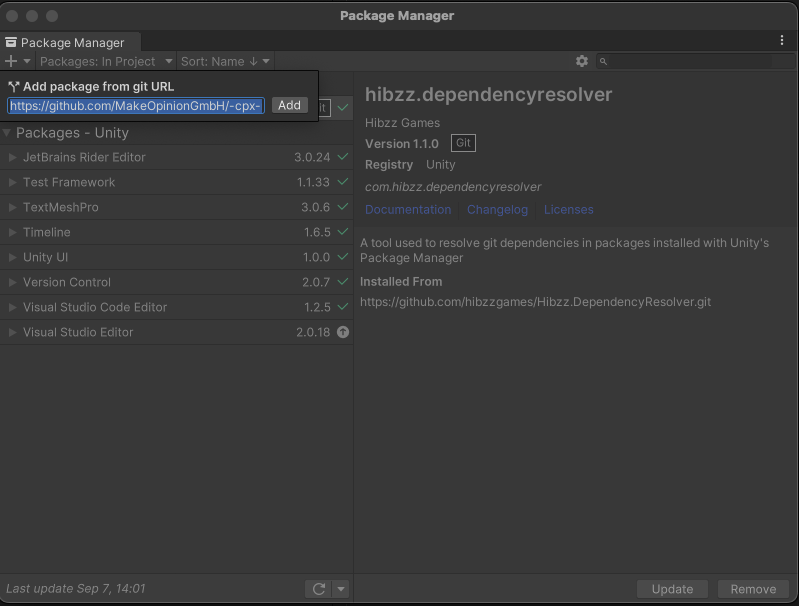
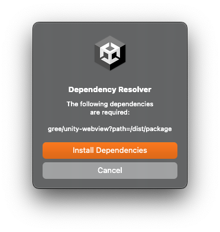
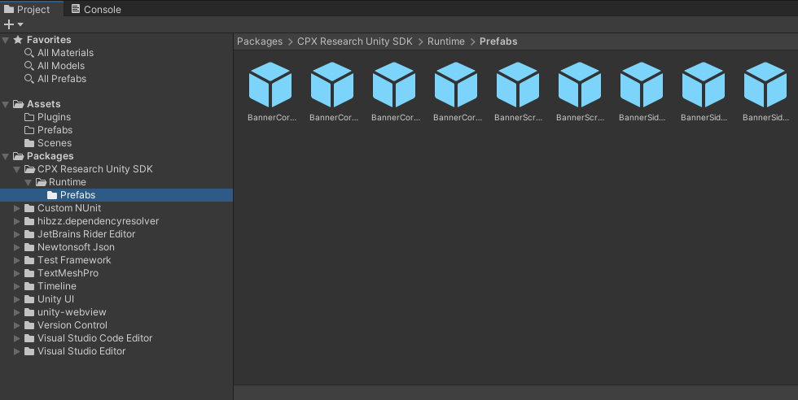
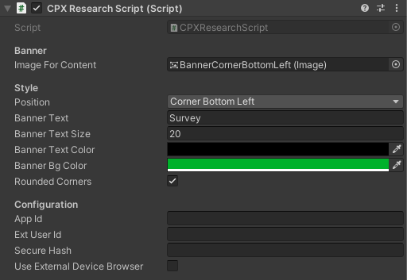
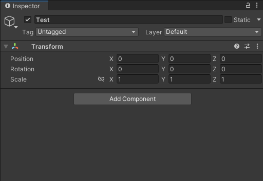
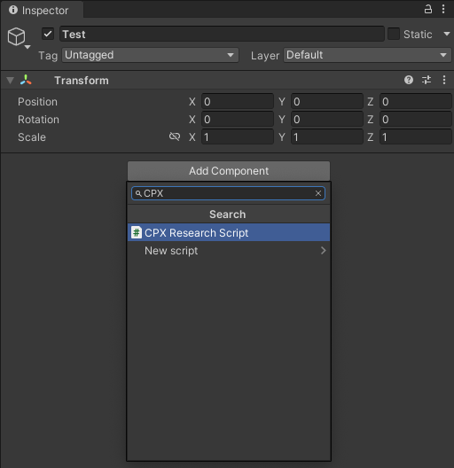

# CPX Research Unity SDK

#### Monetize your product with fun surveys.

We will make it easy for you: Simply implement our solution and be ready to start monetizing your product immediately!
Let users earn your virtual currency by simply participating in exciting and well paid online surveys!

This SDK is owned by [MakeOpinion GmbH](http://www.makeopinion.com).

[Learn more.](https://cpx-research.com/)

# Table of Contents

- [Prerequisites](#prerequisites)
- [Installation](#installation)
- [Usage](#usage)
- [Advanced](#advanced)

# Prerequisites

- .Net 2.0 compatible Unity project
- Unity 2019.1 or later

# Installation

This package has git-dependencies which are not directly supported by Unity (as of Sept 2023), so we use a plugin to resolve the git dependencies.

## Get Hibzz.DependencyResolver
(Github Repo: https://github.com/hibzzgames/Hibzz.DependencyResolver.git)

1. Open the Unity Package Manager (Window -> Package manager)
2. In the top left select the + Icon and choose "Add package from git URL"
3. Enter ```https://github.com/hibzzgames/Hibzz.DependencyResolver.git``` and click add

## Install CPXResearch

1. Open the Unity Package Manager (Window -> Package manager)

2. In the top left select the + Icon and choose "Add package from git URL"



3. Enter ```https://github.com/MakeOpinionGmbH/-cpx-research-SDK-Unity.git?path=/Packages/CPXResearch``` and click add

4. After the package is installed the git dependencies will be resolved and you will be asked to confirm the installation, select Install Dependencies




# Usage

## Using the prefabs

Drag one of the prefabs on your scene and position it according to your needs. The prefabs are pre-configured with the script for using CPX Research. All you need to add are you app id, external user id and the secure hash.



You can customize the following properties



### Style
| Property    | Description |
| -------- | ------- |
| Position  | Select the position of the component. This selects the image that is loaded. Notice: For all positions there are prefabs which also have the correct size configured.    |
| Banner Text | The text that is shown on the banner.     |
| Banner Text Size    | The font size of the banner text.    |
| Banner Text Color | The font color of the banner.
| Banner Bg Color | The background color of the banner.
| Rounded Corners | Check to round corners of the banners.

### Configuration
| Property    | Description |
| -------- | ------- |
| App Id | The application id you find in your Dashboard for your app.
| Ext User Id | The user id your backend has for the current account.
| Secure Hash | The secure hash you'll find in your Dashboard.
| Use External Device Browser | If checked the SDK will give the url to open to the OS so that the device's default browser will be opened. This means the user leaves your App for the survey. If unchecked the SDK will overlay your game with a browser window so the user does not leave your app. The webview used in this case can be found [here](https://github.com/gree/unity-webview)

# Advanced

You can add the component ```CPXResearchScript``` on any game object you like. If you do so you need to connect an image to the script property "Image for content". Also you need to add your app id, external user id and the secure hash.


